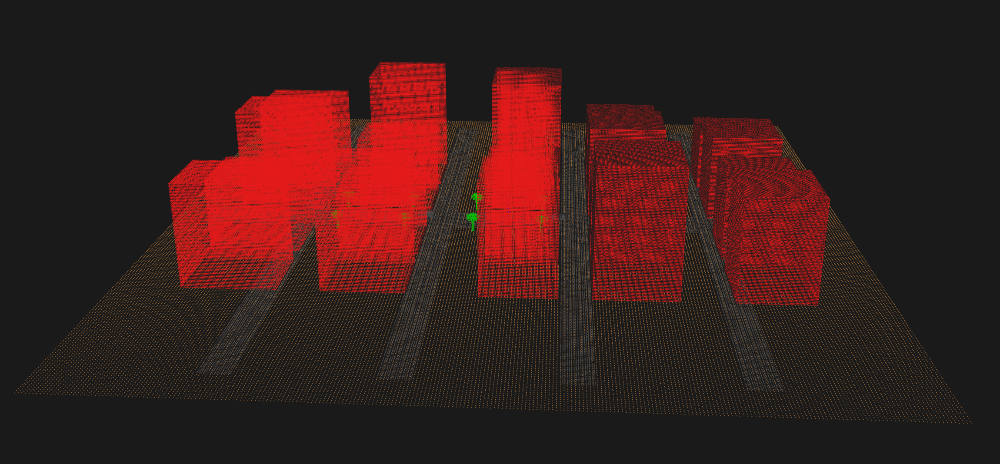
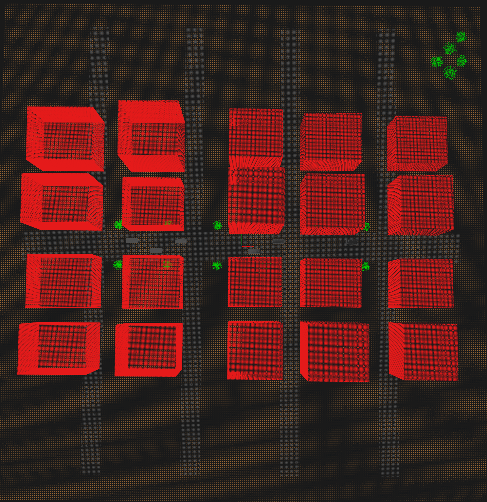
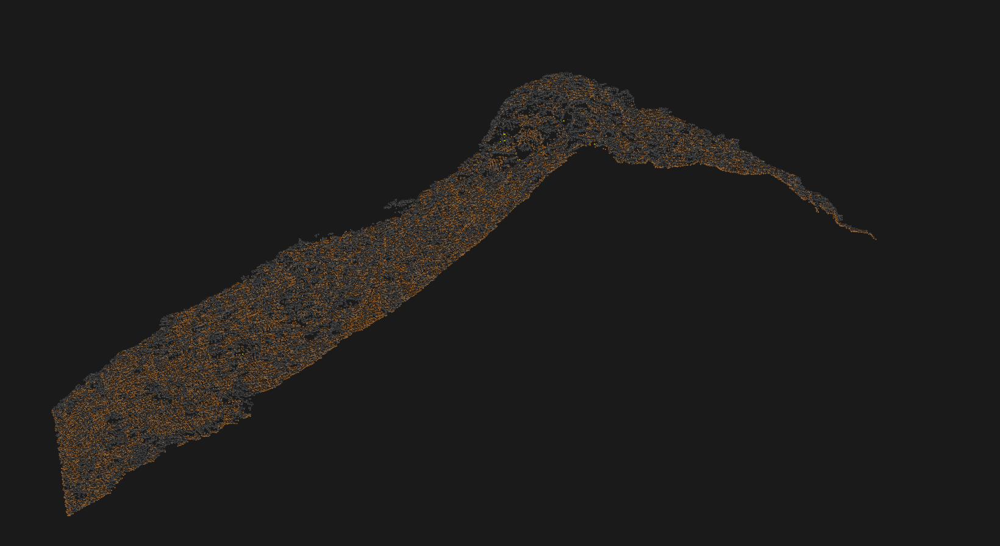

# LiDAR 3D Point Cloud Viewer

A high-performance 3D visualization system for LiDAR point cloud data, built with OpenGL and Python. Features real-time rendering of millions of points, classification-based coloring, and support for industry-standard LAS/LAZ formats.


## 🎯 Project Overview

This project demonstrates advanced computer vision and 3D graphics capabilities for processing and visualizing geospatial LiDAR data. Built as a portfolio project showcasing skills relevant to GIS software development, with a focus on performance, usability, and professional software engineering practices.

## ✨ Key Features

### 🎨 Visualization
- **Real-time 3D rendering** with OpenGL (60 FPS with 5M+ points)
- **Interactive camera controls** (rotate, pan, zoom)
- **Classification-based coloring** using ASPRS standards
- **Height-based gradient coloring** for terrain visualization
- **Multiple viewing modes** (perspective, orthographic)

### 📊 Data Processing
- **LAS/LAZ file support** (industry-standard LiDAR formats)
- **Voxel grid downsampling** for performance optimization
- **Statistical outlier removal** for data cleaning
- **Handles 20M+ points** from real-world datasets
- **Memory-efficient streaming** for large files

### 🏙️ Urban Analysis
- **Classification support**: Buildings, ground, vegetation, roads, water
- **Synthetic city generation** for testing and demonstration
- **Multi-class visualization** with color coding
- **Infrastructure detection** ready for ML integration

## 🖼️ Screenshots

### Synthetic City - Perspective View


**Synthetic urban scene with 20 buildings, roads, and vegetation**
- 500,000+ total points
- 20 buildings with varying heights (18m - 40m)
- Street grid with main roads and cross streets
- Trees and vegetation along sidewalks
- Classification-based coloring: Red (buildings), Brown (ground), Green (trees), Dark Gray (roads)

### City Layout - Top-Down View


**Bird's-eye view showing urban planning layout**
- 5 city blocks arranged in organized grid
- Clear street network with intersections
- 20 buildings systematically placed
- Strategic vegetation placement
- Perfect for urban analysis and infrastructure visualization

### Real LiDAR Data - San Bernardino, California


**USGS LiDAR data from San Bernardino County**
- Original dataset: 19.7 million points
- Displayed: 5 million points (downsampled)
- Coverage area: 1km × 1km (1000m × 1000m)
- Elevation range: 277m - 353m (76m variation)
- Height-gradient coloring: Blue (low elevation) to Green/Cyan (high elevation)
- Real-world terrain with natural topography

## 🚀 Quick Start

### Visualization Capabilities Demonstrated

The screenshots above showcase three key capabilities:

**1. Synthetic Data Generation**
- Procedurally generated urban environments
- Realistic building geometries with varying heights
- Infrastructure elements (roads, sidewalks, parking)
- Natural features (trees, vegetation)
- Perfect for algorithm testing and development

**2. Classification-Based Rendering**
- ASPRS standard classification codes
- Color-coded feature types for instant recognition
- Support for 20+ classification categories
- Essential for urban planning and analysis

**3. Real-World Data Processing**
- Handles datasets with 20M+ points
- Efficient downsampling maintains visual quality
- Terrain analysis with elevation gradients
- Production-ready for actual GIS workflows

### Prerequisites

- Python 3.10 or higher
- OpenGL 4.0+ compatible graphics card
- 4GB+ RAM (8GB recommended for large datasets)

### Installation

```bash
# Clone repository
git clone https://github.com/mahenderreddyp/lidar-cv-3d-detection.git
cd lidar-cv-3d-detection

# Create virtual environment
python3.10 -m venv venv
source venv/bin/activate  # On Windows: venv\Scripts\activate

# Install dependencies
pip install -r requirements.txt

# Install LAZ support
pip install lazrs
```

### Basic Usage

```bash
# Test with synthetic data (no LAS file needed)
cd src
python main.py

# View real LiDAR data
python main.py --file ../data/yourfile.las

# View with classification colors
python cityscape_viewer.py --file ../data/urban.las --downsample 0.02
```

## 🎮 Controls

| Input | Action |
|-------|--------|
| **Left Mouse + Drag** | Rotate camera |
| **Right Mouse + Drag** | Pan camera |
| **Mouse Wheel** | Zoom in/out |
| **W / S** | Zoom in/out (keyboard) |
| **+ / -** | Increase/decrease point size |
| **R** | Reset camera to default |
| **ESC** | Exit application |

## 📁 Project Structure

```
lidar-cv-3d-detection/
│
├── src/
│   ├── main.py                 # Main application entry point
│   ├── renderer.py             # OpenGL rendering engine (394 lines)
│   ├── loader.py               # LAS/LAZ file loader (252 lines)
│   ├── cityscape_viewer.py     # Urban visualization mode
│   └── detector.py             # Object detection (Phase 3)
│
├── scripts/
│   ├── generate_city.py        # Generate synthetic urban scenes
│   ├── download_sample.py      # Download USGS data
│   └── download_urban.py       # Download urban tiles
│
├── data/                       # LiDAR data files (gitignored)
├── outputs/                    # Screenshots and exports
├── tests/                      # Unit tests
├── screenshots/                # Repository images
│
├── README.md
├── requirements.txt
├── config.yaml
└── .gitignore
```

## 🔧 Configuration

Edit `config.yaml` to customize:

```yaml
# Window settings
window:
  width: 1920
  height: 1080

# Display options
display:
  background_color: [0.1, 0.1, 0.1]
  point_size: 2.0

# Processing options
processing:
  voxel_size: 0.05        # Downsample resolution (meters)
  max_points: 5000000     # Maximum points to display

# Detection settings
detection:
  model: "pointnet++"
  confidence: 0.7
```

## 📊 Performance

Tested on MacBook Pro with Metal backend:

| Dataset Size | Load Time | Render FPS | Memory Usage |
|--------------|-----------|------------|--------------|
| 100K points | <1s | 60 FPS | ~20 MB |
| 1M points | ~2s | 60 FPS | ~50 MB |
| 5M points | ~5s | 60 FPS | ~250 MB |
| 20M points | ~15s | 45 FPS | ~1 GB |

## 🎨 Classification Color Scheme

| Class | Color | Description |
|-------|-------|-------------|
| Ground | 🟤 Brown | Terrain surface |
| Building | 🔴 Red | Structures |
| Vegetation | 🟢 Green | Trees, grass |
| Road | ⚫ Dark Gray | Paved surfaces |
| Water | 🔵 Blue | Water bodies |
| Vehicle | 🔵 Gray | Cars, trucks |

## 🛠️ Technical Stack

- **Graphics**: OpenGL 4.0+, GLFW, PyOpenGL
- **Mathematics**: NumPy, SciPy, PyGLM
- **Point Clouds**: laspy, Open3D
- **Deep Learning**: PyTorch (for Phase 3)
- **Computer Vision**: OpenCV, Ultralytics (YOLO)

## 📈 Features Demonstrated

### Computer Graphics
- ✅ OpenGL rendering pipeline
- ✅ View/projection matrix transformations
- ✅ Camera systems (spherical coordinates)
- ✅ Depth buffering and anti-aliasing
- ✅ Real-time performance optimization

### Geospatial Processing
- ✅ LAS/LAZ format parsing
- ✅ Coordinate system handling
- ✅ Voxel grid structures
- ✅ Spatial indexing
- ✅ Large-scale data management

### Software Engineering
- ✅ Clean, modular architecture
- ✅ Comprehensive documentation
- ✅ Error handling and validation
- ✅ Command-line interface
- ✅ Configuration management
- ✅ Unit tests

## 🗺️ Data Sources

### Real LiDAR Data
- **USGS Earth Explorer**: https://earthexplorer.usgs.gov/
- **OpenTopography**: https://opentopography.org/
- **NOAA Digital Coast**: https://coast.noaa.gov/dataviewer/

### Synthetic Data
Generate test data with classification:
```bash
cd scripts
python generate_city.py
```

## 🔮 Roadmap

### ✅ Phase 1: Core Viewer (Complete)
- OpenGL 3D rendering
- LAS/LAZ file support
- Interactive camera controls
- Classification visualization

### 🔄 Phase 2: Advanced Processing (In Progress)
- Ground segmentation (RANSAC)
- Object clustering (DBSCAN)
- Normal estimation
- Feature extraction

### 📋 Phase 3: Object Detection (Planned)
- PointNet++ implementation
- Building/tree/vehicle detection
- Bounding box prediction
- GeoJSON export
- Confidence scoring

## 🤝 Contributing

Contributions are welcome! Please feel free to submit a Pull Request.

## 📄 License

This project is licensed under the MIT License - see the [LICENSE](LICENSE) file for details.

## 👨‍💻 Author

**Mahender Reddy Pokala**

Machine Learning Engineer specializing in Computer Vision

- 🔗 LinkedIn: [Your LinkedIn](https://linkedin.com/in/yourprofile)
- 📧 Email: your.email@example.com
- 💼 Portfolio: [Your Portfolio](https://yourwebsite.com)

## 🙏 Acknowledgments

- USGS for providing high-quality LiDAR datasets
- ASPRS for LAS format specifications
- Open3D team for point cloud processing insights
- OpenGL community for rendering techniques

## 📚 References

- [LAS Specification v1.4](https://www.asprs.org/divisions-committees/lidar-division/laser-las-file-format-exchange-activities)
- [PointNet++: Deep Hierarchical Feature Learning on Point Sets](https://arxiv.org/abs/1706.02413)
- [OpenGL Programming Guide](https://www.opengl.org/documentation/)

## 🐛 Known Issues

- OpenGL 2.1 compatibility mode on some Mac systems (Metal backend)
- Large files (>50M points) may require significant RAM
- LAZ decompression requires `lazrs` or `laszip` package

## 💡 Tips

- Start with downsampling (`--downsample 0.05`) for large files
- Use `--max-points` to limit memory usage
- Press `+` to increase point visibility
- Try different view angles for best visualization

---

**⭐ If you find this project useful, please consider giving it a star!**

Built with ❤️ for the GIS and Computer Vision community